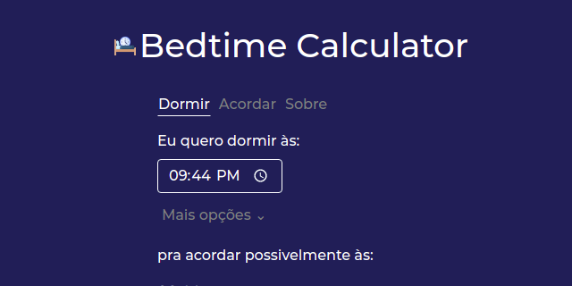

# Bed Time Calculator



## Começando

Instale as dependências:

```sh
yarn
```

Comece o servidor da aplicação:

```sh
yarn dev
```

Você pode interagir com a aplicação no endereço
[http://localhost:1234](http://localhost:1234).

## Recursos extras

[Exemplo de PWA do MDN](https://github.com/mdn/pwa-examples/tree/master/js13kpwa)

[PWA no MDN](https://developer.mozilla.org/en-US/docs/Web/Progressive_web_apps)

[PWA no web.dev](https://web.dev/progressive-web-apps/)

[Abas com JavaScript](https://www.youtube.com/watch?v=sxPEmuW7aUg)


Sim, fazer esse tanto de classe pode ser um overkill,
mas eu tô treinando alguns princícpios do SOLID e TDD.
